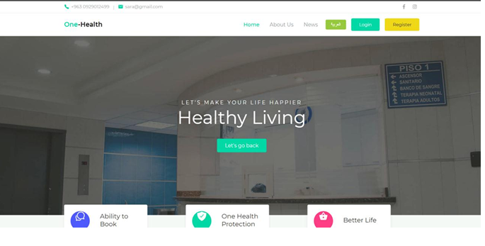
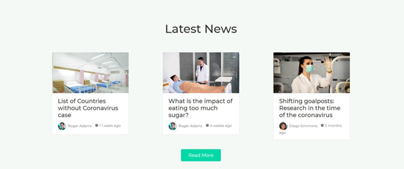

# Electronic Vaccination Tracking System

## Description
A full-stack web application developed to manage and track vaccination records efficiently. The system allows healthcare staff to register patients, record vaccinations, monitor vaccination history, and manage vaccine information through a user-friendly interface.

## Features
- Patient registration and management
- Vaccination record tracking
- Vaccine management
- Search and filter patient records
- Secure database storage
- Responsive user interface

## Technologies
- PHP
- Laravel
- MySQL
- JavaScript
- HTML5
- CSS3
- Bootstrap

## My Role
- Designed and developed the full-stack application.
- Created and managed the MySQL database.
- Built the frontend and backend using Laravel.
- Implemented CRUD operations.
- Tested and debugged the system.

## Screenshots

Screenshots will be added soon.

## Future Improvements
- Email notifications for vaccination reminders.
- Dashboard with statistics and reports.
- Role-based authentication for administrators and staff.

## Screenshots

### 🏠 Home Page
The main page of the Electronic Vaccination Tracking System.

---

### 📰 Medical News
A page displaying the latest medical news and health updates.

---

### 👨‍⚕️ Doctors Directory
A page showing the available doctors in the healthcare center.

